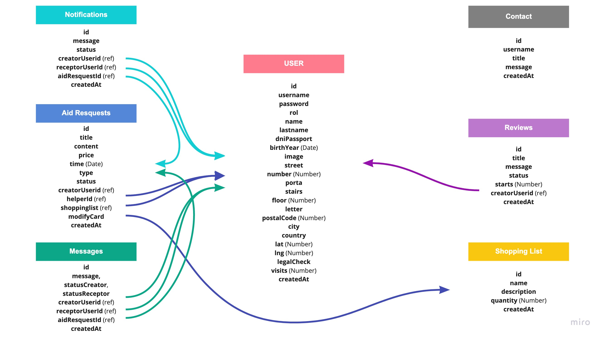

 

### Descripción

---

Descubre el servicio que pone en contacto a personas que **necesitan ayuda** en tareas del día a día con personas que **están dispuestas a ayudar**.

### Guía de usuario

---

Existen 3 perfiles, **el usuario no registrado**, que puede informarse sobre el objetivo, servicios y cualquier información adyacente que necesite, los **Helped** que pueden crear las peticiones de ayuda sobre **lavanderia**, **supermercado**, **parafarmacia**, **Tareas domésticas** y **Animales domésticos** y los **Helpers** que pueden elegir a quien ayudar a través de distintos filtros.

Además existe un perfil **Admin** con el que se puede controlar las reviews, los usuarios y los mensajes de contacto a través de un control de adminsitrador.

### Guía de instalación

---

Se debe diferenciar ente la parte front realizada en **REACT** y la parte back donde usamos **express**.

**API**
Este proyecto consta de 7 colecciones creadas en la base de datos MongoDB, que están relacionadas de la siguiente manera:

 

**Al estar hecho con Node.js** la estructura de archivos es la siguiente:

- **VIEWS:** Utilizando el paquete npm de handlebars para crear las distintas vistas, compuestas de un layout general y diferentes partials que permiten la creacción de los distintos HTML.
- **SEED:** El contenido original de la aplicación proviene de la API [Spoonacular](https://spoonacular.com/), aquí generamos la base de datos inicial del proyecto y los usuarios iniciales.
- **ROUTES:** Gestiona las distintas llamadas para las peticiones a la base de datos (CRUD), y la visualización de las páginas.
- **PUBLIC:** Aquí se encuentran disponibles los recursos estáticos de la aplicación: imágenes, styles y javascript.
- **PASSPORT:** La gestión del logi y la autentificación del usuario se realiza a través del package NPM Passport, aquí puedes encontrar tanto la configuración del paquete como la estrategia local.
- **MODELS:** Utilizamos tres schemas de Moongose: User, Recipe e Ingredients. Los tres están relaccionados para diferentes funcionalidades a través de sus ids de referencia.
- **LIB:** Utilizamos dos middlewares. "isLoggedIn" para la gestión de los usuarios y "hashing" para encriptar la contraseña.
- **CONFIG:** Contiene la configuración del CDN de [Cloudinary](https://cloudinary.com/).

#### Dependencias

- **STRENGTH:** Utilizado para comprobar la seguridad de tu contraseña. [Strength](https://www.jquerycards.com/forms/inputs/strength-js/).
- **AOS:** Libreria para animaciones CSS con scroll. [AOS CSS](https://michalsnik.github.io/aos/).

### Cómo contribuir

---

Toda aportación o comentario será recibido de buen gusto, ya que con ellos se podrá ayudar a crecer tanto la aplicación como a nosotros cómo desarrolladores.

Cualquier mejora será incluida tras una previa revisión a través de un **“pull requests”**. Se requiere un código ordenado y comentado.

Existen muchas **líneas de mejora**, algunas de ellas son:

- **Cambiar Password:** Posibilidad de cambiar la contraseña tras realizar el registro.
- **Tamaño imagenes cloudinare:** Al subir las imágenes al cloudinary, subirlas en las dimensiones requeridas.
- **Receta creada por AUTHOR:** Relacionar la receta con su creador.
- **Lighbox de notificación:** Notificaciones de ayuda de usuario cuando realiza distintas acciones.

### Código de conducta

---

En el siguiente enlace se muestra el [Código de Conducta](https://github.com/Cookin-Team/cookin/blob/master/CODE_OF_CONDUCT.md).

### Autores

---

[Pilar García Campo](https://www.linkedin.com/in/pilargarciacampo/) y [Rubén Vaquero de la Torre](https://www.linkedin.com/in/rubenvaquero/)

### Licencia

---

Aquí se puede consultar la [Licencia](https://github.com/Cookin-Team/cookin/blob/master/LICENSE.md) para este repositorio.
